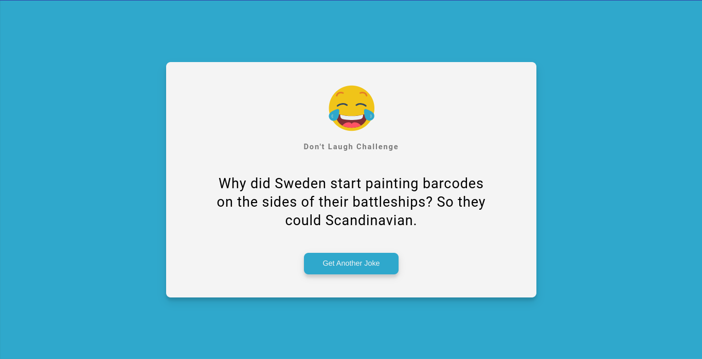

# DadJokesHub

Welcome to DadJokesHub! 🎉

DadJokesHub is a fun and interactive web application that brings a smile to your face by generating hilarious dad jokes with just a click of a button. With a vast collection of witty and cheesy jokes, DadJokesHub is your go-to destination for endless laughter and entertainment.

## Preview



## Features

- **Random Joke Generation**: Get a random dad joke every time you visit the website.
- **Share Jokes**: Easily share your favorite jokes with friends and family via social media.
- **Lightweight and Responsive**: Enjoy a seamless user experience across different devices and screen sizes.
- **API Integration**: DadJokesHub fetches jokes from an external API, ensuring a fresh supply of humor.

## How It Works

DadJokesHub leverages the power of HTML, CSS, and JavaScript to create a simple yet engaging user interface. The application interacts with an external API to fetch random dad jokes and dynamically displays them on the webpage. Users can click a button to generate a new joke or share their favorites with others.

## Technologies Used

- HTML5
- CSS3
- JavaScript
- External Dad Jokes API

## Getting Started

1. Clone this repository:

   ```bash
   git clone https://github.com/freddyfavour/DadJokesHub.git
   ```

2. Navigate to the project directory:

   ```bash
   cd DadJokesHub
   ```

3. Open `index.html` in your preferred web browser.

4. Enjoy endless laughter with DadJokesHub! 😄

## License

This project is licensed under the MIT License - see the [LICENSE](LICENSE) file for details.

---

Ready to start laughing? Fork this repo,run 
```bash
npm install
npm run build
npm run dev
```
and let the fun begin!
